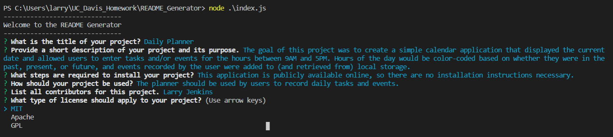

# README Generator

## Description
The goal of this project was to create a command-line application that would prompt users to answer a series of questions and then produce a quality README file based on their responses.

## Acceptance Criteria
1. The application should be run entirely from the command line.
2. Users are prompted with a series of questions, including the title of their project, a description, installation instructions, and licensing information. 
3. After users answer all displayed questions, the application creates a new README file, which includes all of their responses in the appropriate sections.
4. A badge corresponding to the type of license a user chose should display at the top of the README file after the title of the project.  

## Solution
Users will launch this application from the command line, using the following notation: "node .\index.js". This application uses the Inquirer.js from Node Package Manager to ask users a series of questions related to the README file it will produce. 

**Example of syntax for Inquirer questions**

    inquirer
    .prompt([
        {
            type: "input",
            name: "title",
            message: "What is the title of your project?",
        },

Most of the prompts use the "input" type, meaning users will enter text responses to each question. User responses are stored in a JavaScript object, and in the syntax above, the entry included after "name" represents the key to which the response will be correlated. For example, if the user enters the title of their project as "Daily Planner", within the object, it will be represented as follows:

    {title: 'Daily Planner'}

To give users a collection of license choices, a "list" type was used within Inquirer.js. 

**Example of list question for license type**

    {
    type: "list",
    name: "license",
    message: "What type of license should apply to your project?",
    choices: ["MIT", "Apache", "GPL"],
    }

After the user responded to each prompt, the data entered was stored in a JavaScript object denoted as "answers". Since a portion of the acceptance criteria included displaying a badge that corresponded to the type of license chosen by the user, an if statement was used to create a new key/value pair, known as "badgeURL", within the "answers" object. This allowed that data to be referenced within the .md file created by the application.     

**If statement used to create a new key/value pair within the answers object for badgeURL**

    if (answers.license == "MIT") {
            answers.badgeURL = "";
        }
        else if (answers.license == "Apache") {
            answers.badgeURL = "";

        } else {
            answers.badgeURL = "";
        }

The answers were then passed to the function that generated the markup used within the new README file.

**Passing answers object to generateReadMe function and calling function for writing new file with the README content**

    const readMeContent = generateReadMe(answers);

        fs.writeFile("newREADME.md", readMeContent, (err) => 
            err ? console.error(err) : console.log(`The file was created.`)
        );

**Example of template literal used to generate README file content**
    const generateReadMe = (answers) =>

    `# ${answers.title}
    ${answers.badgeURL}

    ## Description
    ${answers.description}

## Technologies Used
1. JavaScript
2. NodeJS
3. Node Package Manager (NPM)
4. Inquirer.js 

## Questions?
Contact me at the following locations:

* Email: <a href="mailto:larrygjenkins@gmail.com">larrygjenkins@gmail.com</a>
* GitHub: <a href="https://github.com/larrygjenkins">github.com/larrygjenkins</a>
* LinkedIn: <a href="https://www.linkedin.com/in/l-jenkins/">linkedin.com/in/l-jenkins</a>

## Location
Use the following link to access the repository associated with this project: [README Generator Repository](https://github.com/larrygjenkins/README_Generator)

Use the following link to view a video demonstration of the application: [README Generator Video Demo](https://drive.google.com/file/d/11E0SRI9G_7fMhlCzn8J8WfXWvPfSmS84/view)

## Example Image
Following is an image of the application:

